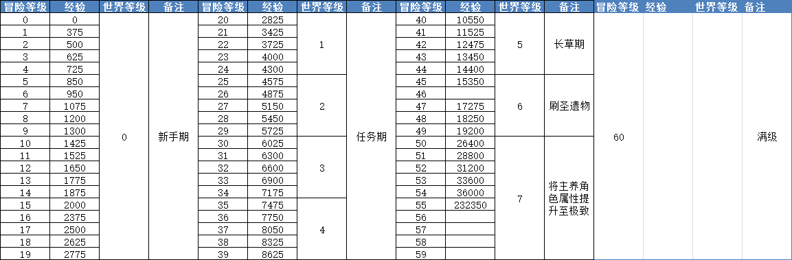
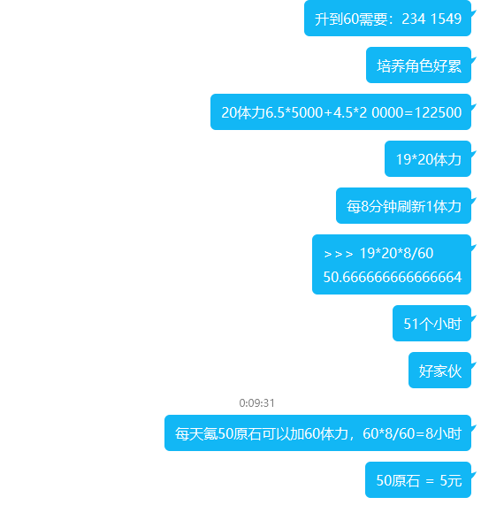
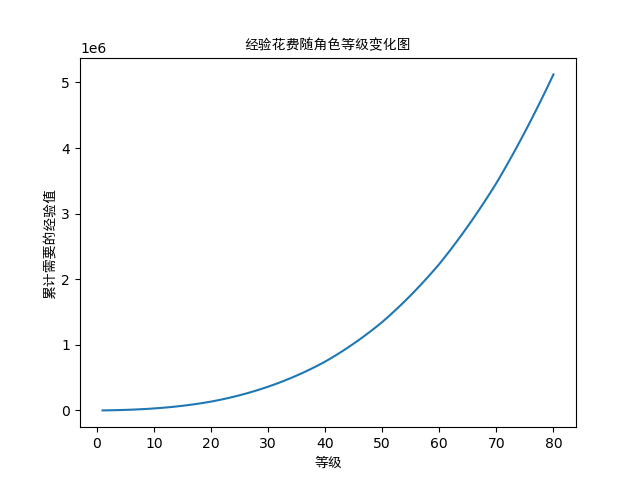
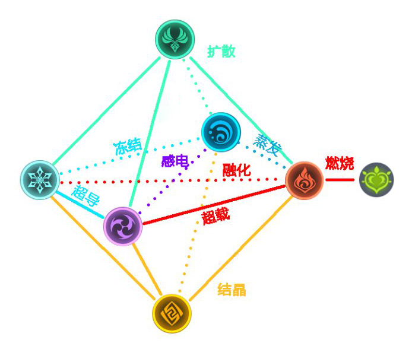
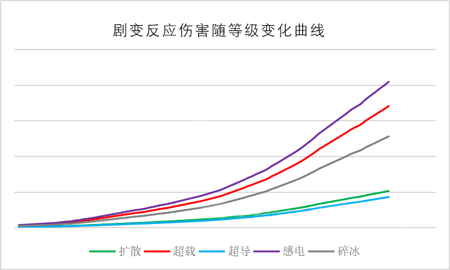
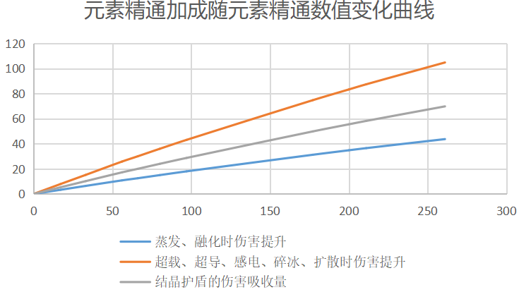
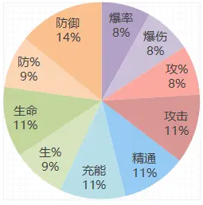
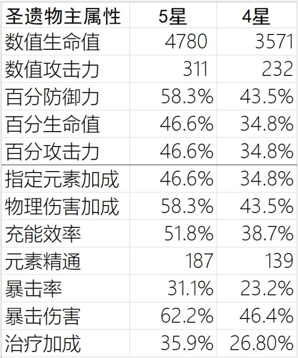
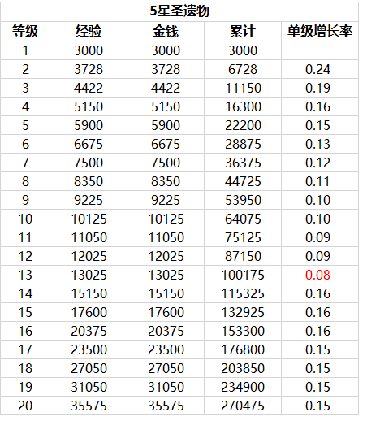
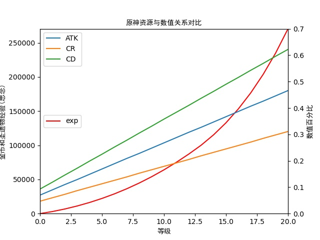

# 原神数值养成分析

前言：

​	该文档的目标：通过对角色基础属性的进行**数值分配** (*数值之间有约束条件有公式*) 计算出**不同定位角色**在**特定的环境**下使得其在**一定时间内**的时间内的**伤害值**达到**最大**

​	需要考虑到的问题：

​									1.如何进行元素属性的搭配 (元素属性有：雷、火、冰、水、风、岩. 即选择那几个元素反应作为输出补充)

​									2.选择哪一属性为主C

​									3.队伍是需要物理输出还是元素输出

​									4.是否需要频繁切换角色(队伍里有4个角色，角色只能在场一个)

### 一、基本设定介绍

##### 1、冒险等级

<center>表 1   冒险等级介绍</center>



##### 2、体力系统

 

##### 3、角色培养

<center>经验花费随角色等级变化表


<center>图 2 经验花费随角色等级变化



### 二、基础属性

- 生命（HP）
- 攻击力(ATK)
- 防御力(DEF)
- 元素精通(ELemental Mastery)
- 体力(Max Stamina)
- 暴击率(crit rate )
- 暴击伤害(critical damage)
- 治疗加成
- 元素充能(Elemental Enegy)
- 元素伤害加成(Elemental damage addition) 
- 物理伤害加成(Physical damage addition)
- 其他辅助功能

#### 1.属性分类

​	**伤害属性**

​		攻击力、暴击伤害、暴击率、元素伤害加成、元素充能、元素精通

​	**防御属性**

​		生命值、防御力、体力

​	**辅助属性**

​		治疗加成、元素精通、元素充能、其他辅助功能

#### 2.角色定位

​	**主C角色**：队伍的主要伤害提供点. 尽可能提高**伤害属性**.

​	**副C角色**：队伍第二强力输出点. 当主C角色还未成型时，可以作为补充输出的点. 可以选择 **伤害+其他**（具体搭配需要按角色、现有武器、刷到的圣遗物、现有升					  级材料而定) 

​	**辅助角色**：一般为挂元素的工具角色或者具有为其他角色进行伤害属性或直接伤害加成，或者有聚怪的能力，例如：温蒂、砂糖. 尽量选择**辅助属性**，聚怪角色  					   尽可能提高元素精通(因为风属性能够同时发生多种元素反应造成巨额元素反应伤害)

​	**奶妈/爸角色**：具有群体回血(回复生命值)的角色. 一般尽量提高奶量加成属性(不同的角色奶量计算公式不同)

#### 3.伤害分类

​	**物理伤害**：一般为弓箭角色、长枪、单手剑双手剑角色，代表角色：雷泽、主C皇女(非谢尔)、罗莎莉亚、物理刻晴

​	**元素伤害**：一般为法典角色、弓箭角色、大剑角色、单手剑，代表角色：可莉、凝光、卢老爷(迪卢克)、公子、雷伤刻晴、皇女、甘雨、魈、胡桃

​	**元素反应伤害**：超载、感电、超导、融化、蒸发、冰冻、结晶、扩散

<center>图 3 元素反应关系 



<center>图 4  剧变反应随等级变化曲线



**伤害比例**：超导 : 扩散 : 碎冰 : 超载 : 感电 = 1 : 1.2 : 3 : 4 : 4.8

**sp：**

​		感电会造成二次伤害

​		超载会产生AOE和爆炸

​		碎冰会解除冰冻效果

​		超导会降低目标40%物理防御

​		扩散产生的元素结晶最多

​		结晶提供护盾和元素充能

**增幅反应**

​	水--火：2.0

​	火--水：1.5

​	火--冰：2.0

​	冰--火：1.5

#### 4.武器分类

<center>表2 武器类别和武器属性类别


| 武器\属性加成 类别 | 攻击力+暴击| 攻击力+爆伤 | 攻击力+被伤 | 攻击力+元充 | 攻击力+元精  | 攻击力+物伤+回复 | 攻击力+生命 |
| :-----------: | :--: |:--:| :--: | :--: | :-----------: | :-----------: | :-----------: |
| 双手剑         |      |      | 古华 | 祭礼 | | | |
| 单手剑         |      |      | | 祭礼、西风 | | 风鹰 | |
| 长枪 |      |      |      | | | | 黑樱枪 |
| 弓箭 |      |      |      | | | | |
| 法典 | 四风 |      |      | | 万国图、祭礼 | | 讨龙 |

#### 5.圣遗物分类

<center>表3 圣遗物套装类别和属性类别


| 套装\属性 | 套装描述 | 攻击力(ATK) | 暴击(CR) | 爆伤(CD) | 元伤(EDA) | 元充 | 元精 | 生命(HP) | 防御(DEF) |
| :-------: | :----: | :--: | ---- | ---- | ---- | ---- | ---- | ---- | ---- |
| 角斗 | 攻击力+近战角色普攻和重击伤害 |        |      |      |      |      |      |      |      |
| 乐团 | 元素精通+远程角色重击 |        |      |      |      |      |      |      |      |
| 宗室 | 元素爆发+全体攻击力加成 |        |      |      |      |      |      |      |      |
| 火套(魔女) | 火伤+火反应伤害 | | | | | | | | |
| 雷套(雷怒) | 雷伤+雷反应伤害+减CD | | | | | | | | |
| 风套(翠绿) | 风伤+扩散伤害+减元素抗性 | | | | | | | | |
| 岩套(古岩) | 岩伤+护盾状态时的元素伤害 | | | | | | | | |
| 冰套 | 冰伤+暴击几率 | | | | | | | | |
| 水套 | 水伤+重击和普攻伤害 | | | | | | | | |
| 染血 | 物伤害+击杀敌人后重击伤害加成 | | | | | | | | |
| 少女套(奶套) | 奶量 | | | | | | | | |
| 抗火套 | 火抗+对火元素影响的敌人伤害加成 | | | | | | | | |
| 抗雷套 | 雷抗+对雷元素影响的敌人伤害加成 | | | | | | | | |
| 逆飞套 | 护盾量+普攻和重击伤害 | | | | | | | | |


### 三、伤害计算公式

#### 1.物理伤害

​	伤害期望
$$
S_物=ATK*(1+CR*CD)*(1+PDA)
$$
​	ATK为攻击力，S为伤害，CR为暴击率，CD为暴击额外伤害，PDA为物理伤害加成

#### 2.元素伤害

​	伤害期望
$$
S_元=ATK*(1+CR*CD)*(1+EDA)
$$
​	EDA为元素伤害加成

#### 3.元素反应伤害

​	                                                       图 5 元素精通对元素反应具有加成

​	

### 四、圣遗物属性分析

- 攻击力(ATK)
- 暴击率(Crit Rate )
- 暴击伤害(Critical Damage)
- 元素伤害加成(Elemental Damage Addition) 
- 物理伤害加成(Physical damage addition)
- 元素精通(Elemental Mastery)
- 生命（HP）
- 治疗加成
- 元素充能(Elemental Energy)
- 防御力(DEF)

##### 1.圣遗物属性分为1个主属性4条副属性

<center>表4 五星圣遗物+20主属性和+0副属性</center>

|     属性类别     |  主属性   |
| :--------------: | :-------: |
|    攻击力/ATK    | 311/46.6% |
|    暴击率/CR     |   31.1%   |
|   暴击伤害/CD    |   62.2%   |
| 元素伤害加成/EDA |   46.6%   |
| 物理伤害加成/PDA |   58.3%   |
|   元素精通/EM    |    187    |
|   元素充能/EE    |   51.8%   |
|    生命值/HP     |   4780    |
|    防御力/DEF    |   58.3%   |

<center>表5 五星圣遗物副属性词条单次增加

| ‘_1’的后缀表示为百分比加成 | ATK  | ATK_1 | CR   | CD   | EM   | EE   | HP   | HP_1 | DEF  | DEF_1 |
| -------------------------- | ---- | ----- | ---- | ---- | ---- | ---- | ---- | ---- | ---- | ----- |
| 最大值                     | 19   | 5.8%  | 3.9% | 7.8% | 23   | 6.5% | 299  | 5.8% | 23   | 7.3%  |
|                            | 18   | 5.3%  | 3.5% | 7.0% | 21   | 5.8% | 269  | 5.3% | 21   | 6.6%  |
|                            | 16   | 4.7%  | 3.1% | 6.2% | 19   | 5.2% | 239  | 4.7% | 19   | 5.8%  |
| 最小值                     | 14   | 4.1%  | 2.7% | 5.4% | 16   | 4.5% | 209  | 4.1% | 16   | 5.1%  |

##### 2.副属性约束分析

​	假设初始圣遗物均为极品(四词条)，即主副词条如下表所示，其中暴击，爆伤，攻击百分比最为重要，主词条必须正确

<center>表6 极致0强化圣遗物

|      |   花    |   羽    |    沙     |        杯         |       冠        |
| :--: | :-----: | :-----: | :-------: | :---------------: | :-------------: |
|  主  | 4780HP  | 311ATK  | 46.60%ATK | 46.6%EDA/58.3%PDA | 31.1%CR/62.2%CD |
|  副  |  19ATK  |  23EM   |   19ATK   |       19ATK       |      19ATK      |
|  副  | 5.8%ATK | 5.8%ATK |   23EM    |      5.8%ATK      |     5.8%ATK     |
|  副  | 3.9%CR  | 3.9%CR  |  3.9%CR   |      3.9%CR       |   3.9%CR/23EM   |
|  副  | 7.8%CD  | 7.8%CD  |  7.8%CD   |      7.8%CD       |   7.8%CD/23EM   |

(1).当理之冠带暴击伤害时

只考虑暴击、爆伤、百分比攻击力

暴击、爆伤、攻击力有以下约束：
$$
\begin{align}
ATK+CR+CD &= 8+8+7+8+7=38 \\
4<=ATK &<= 6+6+6+6=24 \\
5<=CR  &<= 6+6+6+6+6=30 \\
4<=CD  &<= 6+6+6+6=24
\end{align}
$$


目标函数为：
$$
ExpDamage = [ATK_0(1+ATK*5.8\%+46.6\%+ATK_1)+311]*[1+(CR*3.9\%+CR_0)*(CD*7.8\%+62.2\%+CD_0)]*(46.6\%+EDA_0)
$$
其中$CD_0,CR_0,EDA_0$为角色非圣遗物加成词条总和，$ATK_0$为角色基础攻击力，$ATK_1$为角色自身和武器百分比攻击加成

假设:
$$
\begin{align}
ATK_0 &= 800\\
ATK_1 &= 24.6\% \\
CR_0 &= 0 \\
CD_0 &= 0 \\
EDA_0 &= 20\%\\ 
\end{align}
$$
计算出ATK、CR、CD（ATK、CR、CD均为正整数）等于多少时ExpDamage有最大值，最大值为多少？

计算代码：

~~~python
#coding = utf-8
#author = cpx
#created time = 2021-04-19 09:21:55
ATK_0 = 800
ATK_1 = 0.246
CR_0 = 0
CD_0 = 0.5
EDA_0 = 0.2
ans = 0
count = 0
for ATK in range(4,25):
	for CR in range(5, 35-ATK):
		CD = 38 - ATK - CR
		if(CD > 24):
			continue
		count += 1
		ATK_temp = (ATK_0*(1+ATK*0.058+0.466+ATK_1)+311)
		CR_temp = (CR*0.039+CR_0)
		CD_temp = (CD*0.078+0.62+CD_0)
		DA_temp = (0.466+EDA_0)
		Damage = ATK_temp*(1+CR_temp*CD_temp)*DA_temp
		if(ans < Damage):
			ans = Damage
			print('第%d种：'%count, 'ATK:',ATK,'CR:',CR, 'CD:',CD)
			print('ATK:',ATK_temp, 'CR:%.2f'% CR_temp, 'CD:',CD_temp,'ExpDamage:%d'%Damage)
			# print("ATK:%.0f CR：%.2f% CD：%.2f"%(ATK_temp, CR_temp*100, CD_temp*100))
~~~

结果：

~~~python
ATK: 4 CR: 24 CD: 10
攻击力: 1866.2 暴率:94% 爆伤: 190% 预期数值: 8638
~~~

*sp:预期数值为* $攻击力*(1+暴击率*爆伤)*(1+伤害加成)$

##### 3.圣遗物副属性暴击、爆伤、大攻击概率分析

引用：https://www.bilibili.com/read/cv9036899/(这个链接博主分析了四词条的圣遗物爆率)




假设米忽悠很良心，又假设这位博主测试数据量过少，或者他比较黑，我们理想的认为各副属性爆率均为$10\%$

###### (1) 各个位置极品圣遗物基本爆率分析

我们以理之冠带爆伤头为例，如下表，该表不记录表序

|      |  花  |  羽  |  沙  |  杯  |  冠  |
| :--: | :--: | :--: | :--: | :--: | :--: |
|  主  |  HP  | ATK  | ATK  | EDA  |  CD  |

***sp:五级圣遗物的副属性分为四词条和三词条，三词条会在+4是新增一个词条，副词条不会与主词条相同***


**圣遗物分为花、羽、沙、杯、冠**

花：主磁条必为生命值，无需考虑主属性

羽：主磁条必为攻击力，无需考虑主属性

沙：主磁条为攻击力、元素精通、元素充能

杯：主磁条为攻击力、元素伤害加成

冠：主磁条为攻击力、暴击率、暴击伤害、元素精通

<center>图 6 四、五星圣遗物主属性强满



<center>图 7 五星圣遗物培养花费



<center>图 8 圣遗物培养花费和等级关系图



<center>表7 圣遗物强化消耗


|      等级       |   0~4   |   0~8   |   0~12   |   0~16    |   0~20    |
| :-------------: | :-----: | :-----: | :------: | :-------: | :-------: |
|    **资源**     |  16400  |  44825  |  87250   |  153400   |  270575   |
| **以1星为单位** |   39    |   106   |   207    |    365    |    644    |
|    **等级**     | **0~4** | **4~8** | **8~12** | **12~16** | **16~20** |
|    **资源**     |  16400  |  28425  |  42425   |   66150   |  117175   |
| **以1星为单位** |   39    |   67    |   101    |    157    |    278    |

|    星级     |  1   |  2   |  3   |  4   |  5   |
| :---------: | :--: | :--: | :--: | :--: | :--: |
| 提供的思念  | 420  | 840  | 1260 | 2520 | 3780 |
| 以1星为单位 |  1   |  2   |  3   |  6   |  9   |

1-5星 圣遗物提供的经验：$420, 840, 1260, 2520, 3780$

每天捡圣遗物：$25000-30000$

40体力保底奖励：$2\times 3780+4\times 2520 + 8\times 1260 = $27720

以+10五星圣遗物为例:

强化后经验  :  强化前经验  =   $(61169-3780):(64075) \approx0.896$

**code 1: 圣遗物分析代码**

```python
#coding = utf-8
#author = cpx
#creating time = 2020.12.14

in_exps = (0,3000,3728,4422,5150,5900,6675,7500,8350,9225,10125, \
	11050,12025,13025,15150,17600,20375,23500,27050,31050,35575)#五星圣遗物1-20级需要的强化经验
money = in_exps#原神圣遗物强化经验和强化金币需求相同
out_exps = (420,840,1260,2520,3780)#1-5星圣遗物作为强化材料的提供的经验
attributes_main_max = {# +20圣遗物主属性磁条
	'ATK' : 0.466,#攻击力
	'CR' : 0.311,#暴击率
	'CD' : 0.622,#暴击伤害
	'EDA' : 0.466,#元素伤害加成
	'PDA' : 0.583#物理伤害加成
}
attributes_main_min = {# +0圣遗物主属性磁条
	'ATK' : 0.07,#攻击力
	'CR' : 0.047,#暴击率
	'CD' : 0.093,#暴击伤害
	'EDA' : 0.07,#元素伤害加成
	'PDA' : 0.079#物理伤害加成
}
add_exps = [0]*len(in_exps)

#------对in_exp做前缀和得到累积经验-----
for i in range(len(in_exps) - 1):
	add_exps[i+1] = add_exps[i] + in_exps[i+1]

#------计算每级圣遗物主属性增长量----
attributes_main_add = attributes_main_min.copy()#创建初始化
for temp in attributes_main_min.keys():
	attributes_main_add[temp] = (attributes_main_max[temp] - attributes_main_min[temp]) / 20

#------计算各等级圣遗物主属性磁条-----
attributes_main = attributes_main_min.copy()
i = 0
for key in attributes_main.keys():
	attributes_main[key] = [0]*21#初始化长度
	attributes_main[key][0] = attributes_main_min[key]
	for j in range(20):
		attributes_main[key][j+1] = round(attributes_main_min[key] + attributes_main_add[key] * (j+1),3)		
grade = range(21)
```

**code 2： 图像绘制**

```python
#coding = utf-8
#author = cpx
#creating time = 2020.12.14

from matplotlib.font_manager import FontProperties#设置显示中文
import matplotlib.pyplot as plt
import Relics_Attribute_Analysis as Relics_Data #将圣遗物分析代码作为类导入使用

add_exps = Relics_Data.add_exps
grade = Relics_Data.grade
attributes_main = Relics_Data.attributes_main.copy()
for key in attributes_main.keys():
	print(key,attributes_main[key])

font = FontProperties(fname=r"simsun.ttf", size=14)  # ""里面为字体的相对地址 或者绝对地址
f,ax1 = plt.subplots()
ax1.plot(grade, add_exps,color = 'red',label = 'exp')
ax1.set_ylim([0, add_exps[len(add_exps)-1]])
ax1.set_xlim([0, 20])
ax1.set_ylabel(u'金币和圣遗物经验(思念)', fontproperties='SimHei') 
ax2 = ax1.twinx() # 创建第二个坐标轴
# print(attributes_main['ATK'])
ax2.plot(grade,attributes_main['ATK'],label = 'ATK')
ax2.plot(grade, attributes_main['CR'], label = 'CR')
ax2.plot(grade, attributes_main['CD'], label = 'CD')
ax2.set_ylim([0, 0.7])
ax1.set_xlabel(u'等级', fontproperties='SimHei') #设置x轴名称 x label
ax2.set_ylabel(u'数值百分比', fontproperties='SimHei') #设置y轴名称 y label
ax2.set_title(u'原神资源与数值关系对比', fontproperties='SimHei') #设置图名为Simple Plot
ax1.legend(loc = 'center left')
ax2.legend(loc = 'best')

plt.show()
# plt.savefig(fname = '原神资源与数值关系对比.png', figsize = [255,255])
```


### 五、武器属性分析

***sp:*** *不考虑武器被动效果，只分析武器基本属性*

<center>表7 常用80级未突破1精炼武器属性


|                | 攻击力    | 暴击率 | 暴击伤害 | 物理伤害 | 元素充能 | 元素精通 |
| -------------- | --------- | ------ | -------- | -------- | -------- | -------- |
| 狼的末路(五星) | 532+65.3% |        |          |          |          |          |
| 试做古华       | 497+25.1% |        |          |          |          |          |
| 风鹰剑(五星)   | 590+20%   |        |          | 37.7%    |          |          |
| 祭礼单手剑     | 401       |        |          |          | 55.9%    |          |
| 祭礼双手剑     | 497       |        |          |          | 27.5%    |          |
| 西风弓         | 401       |        |          |          | 55.9%    |          |
| 西风大剑       | 401       |        |          |          | 55.9%    |          |
| 西风剑         |           |        |          |          |          |          |
| 绝弦弓         | 449       |        |          |          |          | 151      |
| 万国图谱       | 497       |        |          |          |          | 101      |
| 流浪乐章       | 449       |        | 50.3%    |          |          |          |
| 祭礼法典       | 401       |        |          |          |          | 201      |
| 四风原典       | 532       | 30.2%  |          |          |          |          |

### 六、角色属性数值约束条件推导

#### 1.圣遗物属性约束分析

**假设**：为了推导简化，只考虑+20五星圣遗物的属性

+20的圣遗物主属性磁条都是固定数值，可以先分析副属性，再根据花、羽、沙、杯、冠的主属性选择加入到约束中即可

圣遗物在+4 、+8、+12、+16、+20时会随机对其中一个副属性进行加成

根据表5中的信息我们需要推导出10个副属性之间的约束条件，空白的表示为零

圣遗物副属性有10个属性**X = [ATK,  ATK_1,  CR,  CD,  EM,  EE,  HP,  HP_1,  DEF,  DEF_1]**

10个属性满足：
$$
sum(X./A) = 9
$$
其中
$$
A=[a_{ATK},  a_{ATK\_1},  a_{CR},  a_{CD},  a_{EM},  a_{EE},  a_{HP},  a_{HP\_1},  a_{DEF},  a_{DEF\_1}]
$$
表示对应属性每次强化时增加的大小


### 七、人物分析

**分类**：

双手剑角色：攻速：1下/秒

单手剑角色：攻速：2下/秒

弓箭角色：攻速：2下/秒

以作者角色属性为例，进行人物面板强度分析，不考虑角色天赋影响 (*被动的属性加成由于直接体现在面板中，所以考虑*)

$E=ATK*(1+CR*CD)*(1+DA)$

DA 伤害加成 (主元素伤害的元素伤增计算，物理的用物伤增计算) ，E为预期伤害

**code 5: 人物面板强度简单计算代码实现**

~~~python
# -*- coding: utf-8 -*-
#@author: cpx
#creating time = 2020.12.13

ATK = float(input('输入攻击力：'))
CR = float(input('输入暴击率：'))
CD = float(input('输入暴击伤害：'))
EDA = float(input('输入伤害加成：'))
E_S = ATK*(1+CR*CD)*(1+EDA)
print('预期伤害：%.2f' %E_S)
~~~
